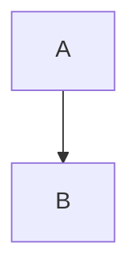

- 添加了样式却不知道如何作用于某个节点，例如我点了添加样式后：

这个 classDef 后面加了个名为 hello 的样式，可是不能作用到某个节点里

- mindmap 里 tab 和 enter 不能添加节点，而是触发了浏览器的“选中下一个表单元素”

- 画布里的节点要做成可点击的，单击一个节点后，这个节点被选中，此时右边的属性也要切换到这个节点，被选中的节点外边加一圈边框，表示被选中，选中后按 tab 添加子节点，enter 添加同级节点

- 连接线也要能点击选中

- 要做到可以双击某个节点来编辑这个节点的显示文本

- 画布里的图要居中，而且鼠标滚轮可以放大缩小，拖拽画布背景可以移动视角

- 要右击弹出菜单：添加节点、添加样式等，把右边的添加节点、添加样式、添加连线这一部分改到菜单里