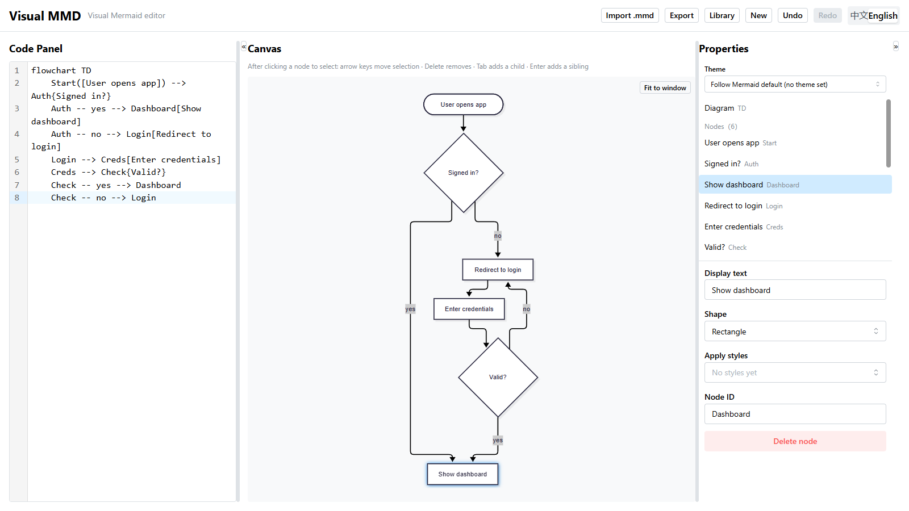

# Visual MMD

[](LICENSE)

简体中文 | [English](README.en.md)

一个纯前端的 Mermaid 可视化编辑器：用结构树与属性表单编辑图表、画布实时预览，不需要先学 Mermaid 语法；同时左侧代码面板始终展示当前图表的 Mermaid 源码，每一次编辑都落在可直改的源码上——用着用着，语法就学会了。



## 为什么做这个

Mermaid 能把文本变成图，但手写语法有门槛；常见的图形化编辑器又把源码藏起来，图画完了，语法还是没学会。Visual MMD 把两件事放进同一个界面：不懂语法也能上手画图，而每一次点击又都能看到它对应哪段源码，顺手把语法学了。

## 特性

- **双面板编辑** —— 左侧代码面板是唯一真相源，右侧画布（结构树 + 属性表单 + 实时预览）与之双向实时同步
- **不用学语法即可编辑** —— 结构树增删元素，属性表单改文本与形状，右键菜单添加节点与连线（连线模式：依次单击起点与终点），双击节点直接在画布上改文本
- **逐字保留** —— 注释、空行、格式习惯与暂时无法解析的语法，编辑不会触碰、原样保留
- **覆盖全部 31 种 Mermaid 图表类型** —— 每种图的核心语法全链路可视化编辑；画布交互按图种的可寻址性分级，可点选的图种支持选中、高亮与内联编辑，其余图种以结构树 + 表单为完整编辑入口
- **图表库** —— 图表保存在浏览器 localStorage 中，支持新建、重命名、复制、删除，全部在本地完成
- **导入 / 导出** —— 导入 `.mmd` 文本文件；导出 `.mmd`、SVG 或高清 PNG
- **PWA** —— 可安装到桌面与手机主屏，支持离线使用，更新自动完成
- **中英界面** —— 界面语言中文 / 英文一键切换，首次启动跟随浏览器语言
- **键盘友好** —— 方向键在画布上按方位移动选中，Tab / Enter 添加子元素与同级，Delete 删除，Ctrl+Z 撤销

<details>
<summary>支持的 31 种图表类型</summary>

<code>flowchart</code> · <code>sequence</code> · <code>class</code> · <code>mindmap</code> · <code>state</code> · <code>er</code> · <code>gitgraph</code> · <code>timeline</code> · <code>kanban</code> · <code>requirement</code> · <code>journey</code> · <code>pie</code> · <code>block</code> · <code>sankey</code> · <code>gantt</code> · <code>quadrant</code> · <code>packet</code> · <code>xychart</code> · <code>radar</code> · <code>architecture</code> · <code>treemap</code> · <code>ishikawa</code> · <code>wardley</code> · <code>venn</code> · <code>cynefin</code> · <code>usecase</code> · <code>treeview</code> · <code>eventmodeling</code> · <code>agentflow</code> · <code>zenuml</code>（只读渲染） · <code>c4</code>

</details>

## 快速开始

需要 Node.js 20.19+（Vite 7 的要求）与 npm。版本要求同时声明在 `package.json` 的 `engines` 与仓库根的 `.nvmrc` 中。

```bash
git clone https://github.com/ZZY2357/visual-mmd.git
cd visual-mmd
npm install
npm run dev        # 开发模式，默认地址 http://localhost:5173
```

CI（GitHub Actions）在每次 PR 与 main 分支提交时自动运行 `npm run typecheck`、`npm test` 与 `npm run build`，全部通过才算绿灯。

生产构建与本地预览：

```bash
npm run build
npm run preview
```

## 部署

线上地址：<https://zzy2357.github.io/visual-mmd/>（GitHub Pages，托管在 `gh-pages` 分支）。

推送一条命令完成构建与发布——在当前分支正常构建后，脚本会把 `dist/` 作为一次独立提交推到 `gh-pages` 分支，全程不切换工作区分支：

```bash
npm run deploy
```

> 首次使用需在 GitHub 仓库的 Settings → Pages 里把 Source 设为 `gh-pages` 分支。

> 你的图表数据只存在浏览器本地（localStorage），不会上传到任何服务器。换浏览器或清空站点数据前，记得先把图表导出为 `.mmd` 备份。

## 贡献

欢迎提 Issue：报 bug 时请附上出问题的 Mermaid 源码与复现步骤。也欢迎直接开 PR；较大的改动建议先开 Issue 讨论一下。

## 许可证

[MIT](LICENSE) © 2026 ZZY2357
